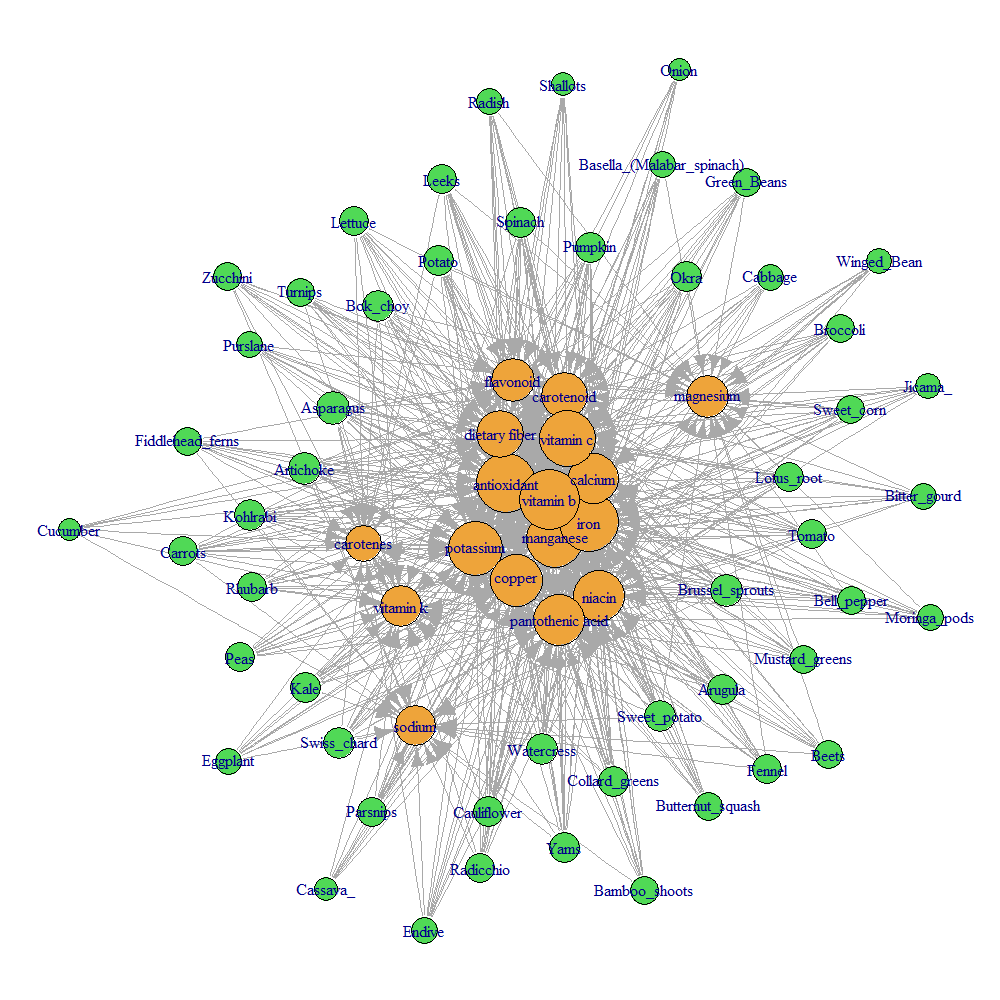

In this project, we aim to analyze the the connections between various vegetables and their nutrient contents. A list of vegetables and descriptions of their health benefits was obtained from [http://www.nutrition-and-you.com](http://www.nutrition-and-you.com/vegetable-nutrition.html). Based on this information, we apply statistics and network analysis to investigate the correlation and the basic workflow is as follows:

1. Parse the informatin from the website.
2. Use text mining to extract key nutrients.
3. Perform statistics and network analysis on the data set.

This report is composed using [RMarkdown](http://rmarkdown.rstudio.com/). All the R/RMD codes and dataset for this SNA project can be found on Github: [https://github.com/lifan0127/SNA_CourseProject](https://github.com/lifan0127/SNA_CourseProject).

*If you are not familiar with RMarkdown style or programming, you can safely skip all the code chunks (shaded sections) and focus on the results and discussion only.*

```{r preparation, message=FALSE, warning=FALSE}
library(tm)
library(knitr)
library(stringr)
library(RWeka)
library(reshape2)
library(ggplot2)
library(gridExtra)
library(igraph)
library(dplyr)  # version 0.3 required

# Load "vegetables" data frame from vegetable.RData
load("data/vegetables.RData")

```


### Parse the informatin from the website

The data was parsed from [http://www.nutrition-and-you.com](http://www.nutrition-and-you.com/vegetable-nutrition.html) using the *RCurl* and *XML* packages in R. The script can be found in the [Github reposity](https://github.com/lifan0127/SNA_CourseProject) associated with this project. The basic steps includes:

1. Parse vegetable names, images and links from [http://www.nutrition-and-you.com/vegetable-nutrition.html](http://www.nutrition-and-you.com/vegetable-nutrition.html).
2. Following the links, parse the health benefits for each vegetable.
3. Manual check to confirm consistency.

A sample of the data (first 5 vegetables) is shown below:

```{r results='asis'}
kable(vegetables[1:5, c("img", "Name", "Link")])

```


### Define Nutrient Terms via Text Mining

The first task was to determine the most important nutrient terms asssociated with vegetables. Herein we used the frequencies of terms appearing in the health benefit description as the measure. First, we computed the frequency distribution of all term, 2-gram, 3-gram and 4-grams using the *tm* and *RWeka* packages in R.

```{r data_preprocessing}
corpus.preprocess <- function(corpus){
  # Helper function to preprocess corpus
  processed.corpus <- corpus %>%
    tm_map(content_transformer(tolower)) %>%
    tm_map(removeNumbers) %>%
    tm_map(removePunctuation) %>%
    tm_map(removeWords, stopwords("english")) %>%
    tm_map(stripWhitespace)
  return(processed.corpus)
}

corpus <- VCorpus(DirSource("text")) %>% corpus.preprocess()

dtm <- DocumentTermMatrix(corpus) 

twogramTokenizer <- function(x) NGramTokenizer(x, Weka_control(min = 2, max = 2))
dtm.2g <- DocumentTermMatrix(corpus, control=list(tokenize = twogramTokenizer))

threegramTokenizer <- function(x) NGramTokenizer(x, Weka_control(min = 3, max = 3))
dtm.3g <- DocumentTermMatrix(corpus, control=list(tokenize = threegramTokenizer)) 

fourgramTokenizer <- function(x) NGramTokenizer(x, Weka_control(min = 4, max = 4))
dtm.4g <- DocumentTermMatrix(corpus, control=list(tokenize = fourgramTokenizer)) 

```

Below we plotted the top 20 most frequnt terms and [n-grams](http://en.wikipedia.org/wiki/N-gram) (contiguous sequence of n words). We limited our analysis to n=2~4 as it becomes unlikely to have concepts represented by more than 4 words.

```{r term_frequency, fig.width=6.5, fig.height=3, dpi=300}
most.freq <- function(dtm, n=20){
  # Helper function to find the most frequent n words
  freq <- colSums(as.matrix(dtm))
  result <- freq[order(freq, decreasing=TRUE)][1:n]
  return(data_frame(term=names(result), count=result))
}

ggplot(most.freq(dtm, 20), aes(x=reorder(term, -count), y=count)) +
  geom_bar(stat="identity") +
  theme_bw() +
  theme(axis.title.x = element_blank(),
           axis.text.x  = element_text(angle=45, hjust=1)) +
  ggtitle("Most frequent words in health benefits")

ggplot(most.freq(dtm.2g, 20), aes(x=reorder(term, -count), y=count)) +
  geom_bar(stat="identity") +
  theme_bw() +
  theme(axis.title.x = element_blank(),
           axis.text.x  = element_text(angle=45, hjust=1)) +
  ggtitle("Most frequent 2-gram in health benefits")

ggplot(most.freq(dtm.3g), aes(x=reorder(term, -count), y=count)) +
  geom_bar(stat="identity") +
  theme_bw() +
  theme(axis.title.x = element_blank(),
           axis.text.x  = element_text(angle=45, hjust=1)) +
  ggtitle("Most frequent 3-gram in health benefits")

ggplot(most.freq(dtm.4g), aes(x=reorder(term, -count), y=count)) +
  geom_bar(stat="identity") +
  theme_bw() +
  theme(axis.title.x = element_blank(),
           axis.text.x  = element_text(angle=45, hjust=1)) +
  ggtitle("Most frequent 4-gram in health benefits")

```

Then, we manually examined those terms and chose the most frequent, heal-related nutrient concepts from the data. Further, we built a alias list to combine terms belonging to the same concepts (e.g. pyridoxine, folic acid, niacin and thiamin all belong to Vitamin B family). Finally, we performed some additional clean-up. For example, manually changing "VitaminC" to "Vitamin C" etc.

```{r term_selection}
terms <- c("Antioxidant", "Potassium", "Manganese", "Iron", "Copper", "Calcium",
           "Niacin", "Carotenes", "Carotenoid", "Flavonoid", "Sodium", "Magnesium",
           "Vitamin C", "Vitamin B", "Dietary Fiber", "Pantothenic Acid",
           "Vitamin K")

alias <- c(Pyridoxine="Vitamin B", Folates="Vitamin B", "Folic Acid"="Vitamin B", Thiamin="Vitamin B", riboflavin="Vitamin B", "Superoxide dismutase"="Antioxidant", VitaminC="Vitamin C", Zeaxanthin="Carotenoid", Lutein="Carotenoid")

# Creat a new dtm containing all 1-4 grams and subset with terms/alias
aliasTrans <- content_transformer(function(x, alias) {
    for(i in 1:length(alias))
      x <- gsub(tolower(names(alias[i])), tolower(alias[i]), x)
    return(x)
  })
new.corpus <- tm_map(corpus, aliasTrans, alias)
tokenizer <- function(x) NGramTokenizer(x, Weka_control(min = 1, max = 4))
dtm.all <- DocumentTermMatrix(new.corpus, control=list(tokenize = tokenizer)) 
dtm.trimmed <- dtm.all[, tolower(terms)]

```

Afterwards, we filtered the document-term matrix using the terms and alias and the resulting new matrix contains 17 nutrient terms. 


### Construct Vegetable-Nutrient Pairs and Network

Thereafter, we used the term list to build vegetable-nutrient pairs. Each pair, formed if a nutrient was mentioned in the health benefit description of a vegetable, represents that the vegetable is a good/significant source of the particular nutrient. The vegetable-nutrient pairs collectively constitute a directed graph structure that was used for the subsequent network analysis.

```{r vegetable_nutrient_network}
vegetable.nutrient <- as.data.frame(as.matrix(dtm.trimmed)) %>%
  mutate(Vegetable=vegetables$Name) %>%
  melt(id="Vegetable", variable.name="Nutrient", value.name="Count") %>%
  filter(Count>0) 

```


### Visualization of the Vegetable-Nutrient Network

The following plot illustrates the connections between vegetables and the nutrients they supplies. Each vegetable and nutrient are represented by a node (with different colors) and the relationship are represented by a directed edge.

```{r network_analysis, dpi=300}

g <- graph.data.frame(vegetable.nutrient)

V(g)$color <- ifelse(tolower(V(g)$name) %in% tolower(vegetables$Name), "#50d956", "#eea43a")
V(g)$size <- sqrt(degree(g))*2

par(mar=c(0.1, 0.1, 0.1, 0.1))
png(file="image/network.png")  # has color issue in knitr
set.seed(1)
plot(g, layout=layout.fruchterman.reingold, edge.arrow.size=0.5)
dev.off()

```




### Results and Discussion

Some discussion about this network:

* The trimmed document term matrix has a sparsity of only 32%, which suggests on average each vegetable supplies ~68% kinds of nutrients identified in this study. 
* In deed, we found each vegetable supplies about 10 types of nutrients, in which the top three vegetables are Asparagus, Artichoke and Brussel sprouts.
* On the other hand, each nutrient are available from several vegetables, in which the most available nutrients are Vitamin B, Iron and Antioxidant.
* Because this is a [bipartite graph](http://en.wikipedia.org/wiki/Bipartite_graph), concepts such as clique and clustering are largely not applicable.

```{r fig.width=6.5, fig.height=3, dpi=300}
vegetable.nutrient %>%
  group_by(Vegetable) %>%
  summarize(Nutrient.type=n()) %>%
  ggplot(aes(x=reorder(Vegetable, -Nutrient.type), y=Nutrient.type)) +
  geom_bar(stat="identity") + 
  theme_bw() +
  theme(axis.title.x = element_blank(),
           axis.text.x  = element_text(angle=45, hjust=1)) +
  ggtitle("Type of nutrients supplied by vegetables")

vegetable.nutrient %>%
  group_by(Nutrient) %>%
  summarize(Vegetable.type=n()) %>%
  ggplot(aes(x=reorder(Nutrient, -Vegetable.type), y=Vegetable.type)) +
  geom_bar(stat="identity") + 
  theme_bw() +
  theme(axis.title.x = element_blank(),
           axis.text.x  = element_text(angle=45, hjust=1)) +
  ggtitle("Nutrient availability from multiple vegetables")
